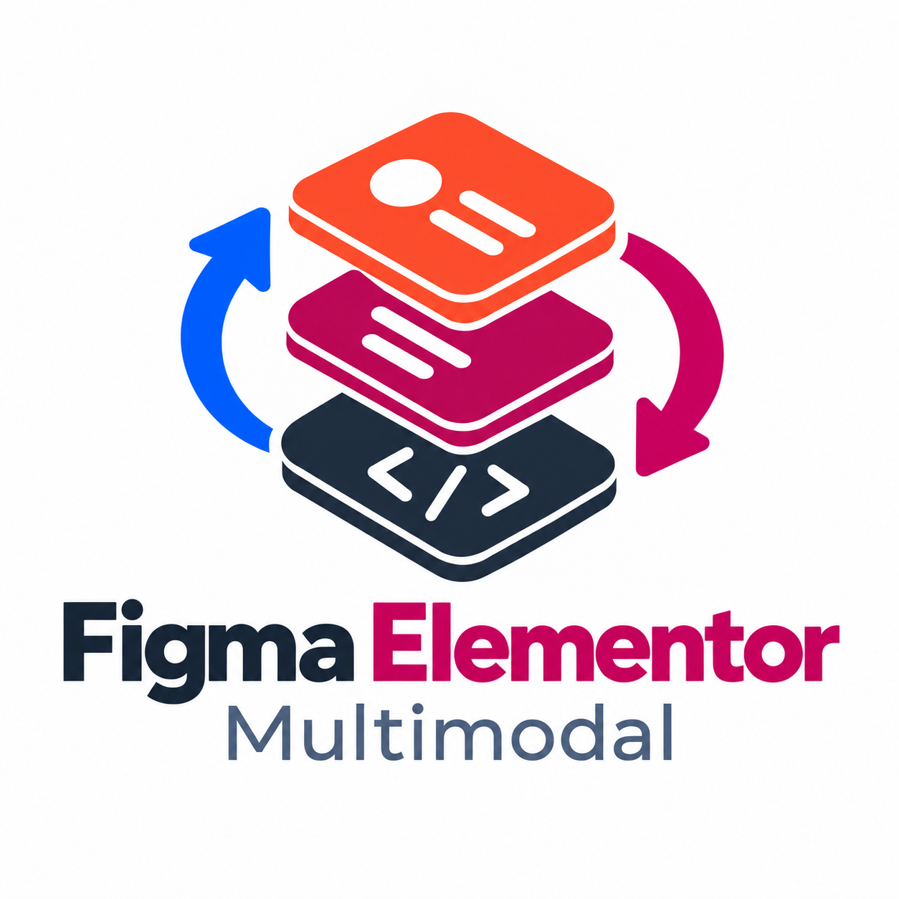

# Figma Elementor Multimodal

<p align="center">
  
</p>

Figma Elementor Multimodal (FEM) is an open-source, self-hosted bridge for bringing a Figma selection into WordPress as editable Elementor elements or native Gutenberg blocks.

**Current status: 0.1.0 beta.** The project is suitable for controlled testing environments. Always validate the imported page before publishing it on a production website. See the [changelog](CHANGELOG.md) and [release checklist](docs/RELEASE-CHECKLIST.md).

🇮🇹 [Italiano](README.it.md) · [Documentation in English](docs/en/README.md) · [Documentazione italiana](docs/README.md)

## What it does

- Imports a selected Figma frame or component into WordPress.
- Builds recognized layouts as native Elementor elements or the `FEM Scene` Gutenberg block.
- Preserves a deterministic FEM node/class mapping to support traceability and future reverse-sync work.
- Imports image assets through a staged, integrity-checked pipeline.
- Uses a short-lived pairing flow between Figma and a specific WordPress site.
- Includes **FEM Setup**, a desktop wizard that creates a site-scoped Figma development-plugin package.

FEM is deliberately **one-way** in this beta: Figma → WordPress. It does not overwrite a Figma file from WordPress.

## Requirements

- WordPress 7.0 or later and PHP 8.3 or later.
- Elementor 3.20 or later when Elementor is the selected output.
- A valid, active Figma license and Figma Desktop with development plugins enabled.
- HTTPS for a real website. Plain HTTP is accepted only for `localhost`, `127.0.0.1`, or `[::1]` when local mode is explicitly enabled.

For GNU/Linux, FEM supports the manual-development-plugin flow with [Figma-Linux](https://github.com/Figma-Linux/figma-linux). Its ability to load a development manifest depends on the installed Figma-Linux build and must be checked locally.

## Quick start

1. Install and activate the WordPress package from [`packages/wordpress-plugin`](packages/wordpress-plugin).
2. In WordPress, open **Tools → FEM Pairing**, choose the credential duration, and generate a pairing code.
3. Build or run the wizard in [`apps/installer`](apps/installer); enter the site URL, verify it, and prepare the Figma package.
4. In Figma Desktop, select **Plugins → Development → Import plugin from manifest…** and choose the manifest generated by FEM Setup.
5. Open FEM, paste the Pairing ID and code, select a frame or component, choose Elementor or Gutenberg, and import.
6. Review the resulting page at desktop, tablet, and mobile widths before publishing.

Detailed guides: [WordPress setup](docs/en/WORDPRESS.md), [Figma setup](docs/en/FIGMA.md), [installer status](docs/en/INSTALLER.md), and [known limits](docs/en/LIMITATIONS.md).

## Repository layout

```text
packages/
  figma-plugin/       Figma development plugin
  wordpress-plugin/   WordPress, Elementor, and Gutenberg integration
apps/installer/       FEM Setup desktop wizard (Tauri)
assets/brand/         Approved FEM visual assets and tokens
docs/                 Italian documentation
docs/en/              English documentation
tools/                Reproducible validation and release helpers
```

## Security and privacy

No URL, pairing code, bearer credential, API key, or private key is stored in this repository. FEM uses site-scoped, expiring credentials; the server stores their HMAC-SHA-256 hashes rather than plaintext bearer values. Read the [security policy](SECURITY.md) before deploying it beyond a test environment.

## License

Figma Elementor Multimodal is distributed under the [GNU Affero General Public License v3.0](LICENSE).

The names Figma, WordPress, Gutenberg, and Elementor belong to their respective owners. FEM is an independent project and is not affiliated with or endorsed by them.

## Author

Davide Pica — [@davidebr90](https://github.com/davidebr90)
